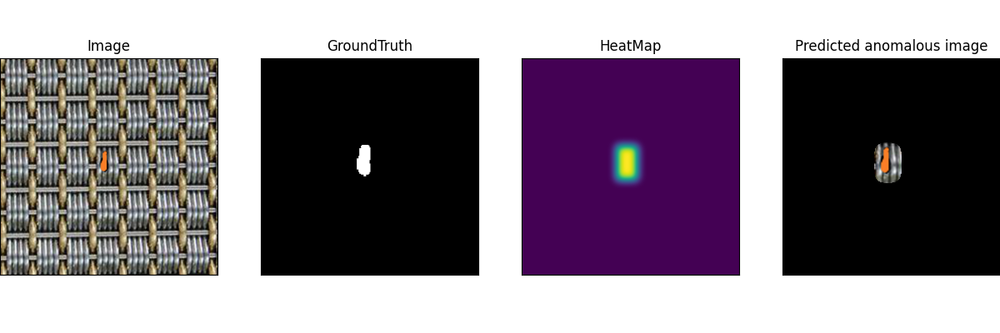

# TexSCAN : Zero-shot Industrial Texture Anomaly Detection using DBSCAN algorithm
This repository contains the code for the above mentioned paper submission:



## Requirement
* Python version 3.9.18
* Pytorch version 2.1.2
* Pillow version 9.5 ***(< 10)***
```shell
conda create -n texscan
conda activate texscan 
pip install -r requirements.txt
```

## Datasets
The datasets utilized in the paper are available for download via
* [MVTec AD](https://www.mvtec.com/downloads) (textures only)
* [BTAD](https://github.com/pankajmishra000/VT-ADL?tab=readme-ov-file#beantech-anomaly-detection-dataset---btad) (02 only)
* [WFT](https://www.mvtec.com/company/research/publications)
* [WFDD](https://drive.google.com/file/d/1P8yfNnfoFsb0Lv-HRzkPQ2nD9qsL--Vk/view?usp=sharing/)
* [DTD-Synthetic](https://drive.google.com/drive/folders/10OyPzvI3H6llCZBxKxFlKWt1Pw1tkMK1)

. All datasets must be stored in the directory `../data`.

## Usage
To visualize it, uncomment the visualization function (line 148) of `~src/main.py`.

In order to run all datasets utilized in the paper, run
```shell
sh script.sh
```
. Or for the specific dataset, run
```shell
python main.py --m 50 --dataset 'DTD-sys'
python main.py --m 200 --dataset 'MVTec'
python main.py --m 250 --dataset 'BTAD'
python main.py --m 150 --dataset 'WFT'
python main.py --m 200 --dataset 'WFDD'
```
. Results can be shown in `~/src/result`.